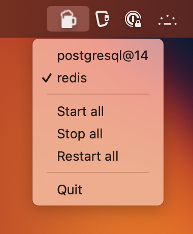

# homebrew-services-tray-icon

Start, stop and track installed Homebrew services from your macOS menu bar.

<center>
    
</center>

# How to use

- Clone this repo

    ```
    git clone https://github.com/Icheka/homebrew-services-menubar.git

    cd homebrew-services-menubar
    ```

- Install dependencies

    ```
    yarn
    ```

- Run app
    ```
    yarn dev
    ```

# To create a production build

```
yarn build:mac
```

**Note**

I created this package entirely to solve a problem I had -- tracking running services on my Mac. As is, the app was intended to work **only** on Macs.

You can extend it to be used on other platforms, if you like.

You'll find that I left configuration, scripts, etc for both Windows and Linux. This should ease your way if you need to adapt it to a different OS.

## License

[**MIT**](./LICENSE)